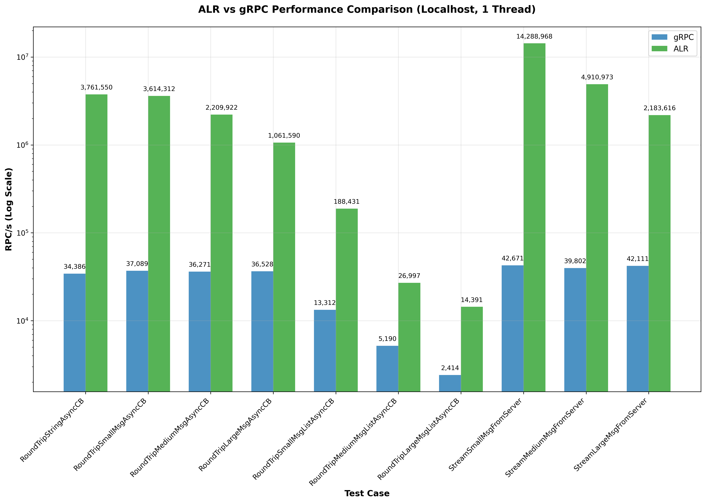
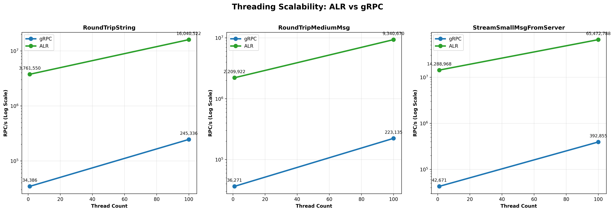
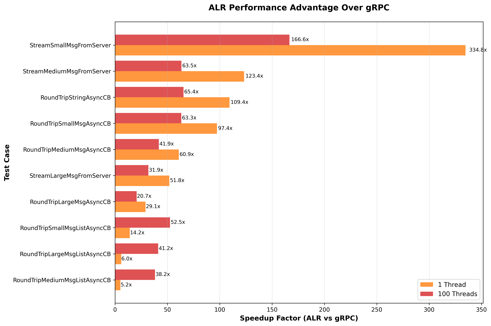
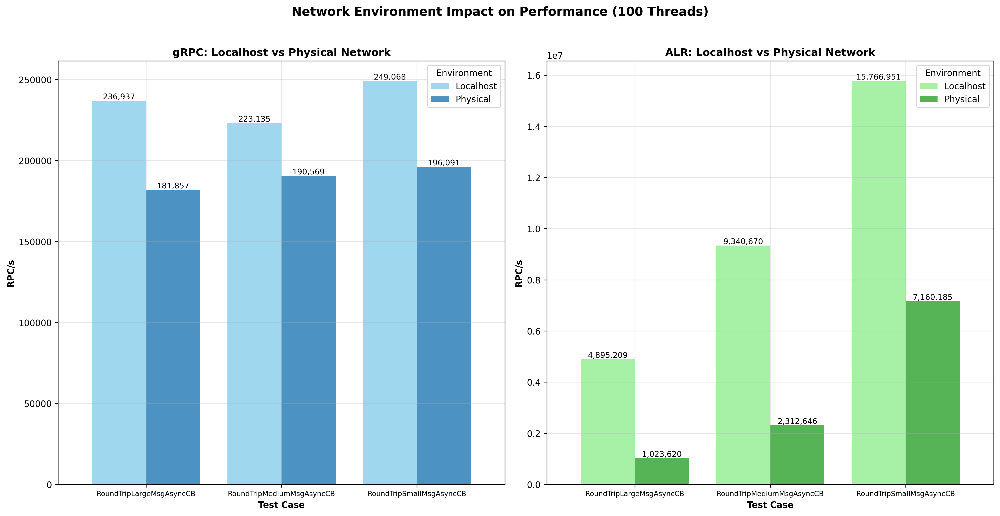

# AtomicLinkRPC Benchmarks

This document consolidates representative performance characteristics of AtomicLinkRPC (ALR) versus gRPC and provides interpretive analysis. All numbers below are illustrative summaries based on previously gathered runs; exact results vary by hardware, build flags, network, and TLS settings.

All tests use a single client process and a single service process. The tests are executed both using `localhost` (loopback) as well as between two physical hosts connected with a 2.5Gbps Ethernet connection. Most tests have two versions, one using a single thread, and one using multiple threads in order to test scalability. Results with and without TLS (OpenSSL) are reported.

There are 3 different sized messages (or structs in the case of ALR) used in the various tests. The sections below show how they are declared in the `proto` file for the gRPC tests, and in the header file in the case of ALR:

<details>
<summary>Expand to see Proto definitions for gRPC</summary>

```protobuf
syntax = "proto3";

package benchmark;

//...

message SmallMessage {
	int32 value = 1;
	string str = 2;
}

message MediumMessage {
   uint32 val1 = 1;
   int64 val2 = 2;

   string str1 = 3;
   string str2 = 4;

   repeated uint32 list1 = 5;
   repeated string list2 = 6;

   float float_val = 7;
   double double_val = 8;

   string optStr = 9;
}

message LargeMessage {
   int32 sint32_val = 1;
   uint32 uint32_val = 2;
   int64 sint64_val = 3;
   uint64 uint64_val = 4;
   float  float_val = 5;
   double double_val = 6;
   bool   bool_val = 7;
   int32  char_val = 8; 

   string string_val = 9;

   repeated uint32 uint32_list = 10;
   bytes byte_buffer = 11;
   repeated string string_list = 12;

   SmallMessage small_msg = 13;
   MediumMessage medium_msg = 14;
}

message SmallMsgList {
   repeated SmallMessage small_msgs = 1;
}

message MediumMsgList {
   repeated MediumMessage medium_msgs = 1;
}

message LargeMsgList {
   repeated LargeMessage large_msgs = 1;
}
```
</details>

<details>
<summary>Expand to see how the Protobuf messages are populated for gRPC</summary>

```cpp
SmallMessage CreateSmallMessage()
{
   SmallMessage sm = {};
   sm.set_value(123);
   sm.set_str("Hello World");
   return sm;
}


MediumMessage CreateMediumMessage()
{
   MediumMessage mm = {};
   mm.set_val1(123);
   mm.set_val2(456);
   mm.set_float_val(12.3f);
   mm.set_double_val(45.6);
   mm.set_str1("Hello 1 123");
   mm.set_str2("Hello 1 456");
   mm.add_list1(345);
   mm.add_list1(456);
   mm.add_list2("Hello 567");
   mm.add_list2("Hello 789");
   return mm;
}


LargeMessage CreateLargeMessage()
{
   LargeMessage lm;
   lm.set_sint32_val(123);
   lm.set_uint32_val(345);
   lm.set_sint64_val(567);
   lm.set_uint64_val(890);
   lm.set_float_val(12.3f);
   lm.set_double_val(45.6);
   lm.set_string_val("Hello 1234");
   lm.add_uint32_list(234);
   lm.add_uint32_list(567);
   lm.mutable_byte_buffer()->resize(32, 'A');
   lm.add_string_list("Hello 4567");
   lm.add_string_list("Hello 8901");
   *lm.mutable_small_msg() = CreateSmallMessage();
   *lm.mutable_medium_msg() = CreateMediumMessage();
   return lm;
}

SmallMsgList CreateSmallMessageList(int count)
{
   SmallMessage sm = CreateSmallMessage();
   SmallMsgList smList;

   for (int i = 0; i < count; i++) {
      *smList.add_small_msgs() = sm;
   }

   return smList;
}

MediumMsgList CreateMediumMessageList(int count)
{
   MediumMessage mm = CreateMediumMessage();
   MediumMsgList mmList;

   for (int i = 0; i < count; i++) {
      *mmList.add_medium_msgs() = mm;
   }

   return mmList;
}

LargeMsgList CreateLargeMessageList(int count)
{
   LargeMessage lm = CreateLargeMessage();
   LargeMsgList lmList;

   for (int i = 0; i < count; i++) {
      *lmList.add_large_msgs() = lm;
   }

   return lmList;
}
```
</details>
<details>
<summary>Expand to see how the C++ structs are declared for ALR</summary>

```cpp
struct SmallStruct
{
   uint32 val1;
   std::string str;
};

struct MediumStruct
{
   sint32 val1;
   uint32 val2;

   std::string str1;
   std::string str2;

   std::vector<uint32> vec1;
   std::vector<std::string> vec2;

   float floatVal;
   double doubleVal;

   std::optional<std::string> optStr;
};

struct LargeStruct
{
   sint32 sint32Val;
   uint32 uint32Val;
   sint64 sint64Val;
   uint64 uint64Val;
   float  floatVal;
   double doubleVal;
   bool   boolVal;
   char   charVal;

   std::string stringVal;

   std::vector<uint32> uint32Vec;
   std::vector<uint8> byteBuffer;
   std::vector<std::string> stringVec;

   SmallStruct smallStruct;
   MediumStruct mediumStruct;
};
```
</details>
<details>
<summary>Expand to see how the C++ structs are populated for ALR</summary>

```cpp
SmallStruct CreateSmallStruct()
{
   SmallStruct ss = {};
   ss.val1 = 123;
   ss.str = "Hello World";
   return ss;
}

MediumStruct CreateMediumStruct()
{
   MediumStruct ms = {};
   ms.val1 = 123;
   ms.val2 = 456;
   ms.floatVal = 12.3f;
   ms.doubleVal = 45.6;
   ms.str1 = "Hello 1 123";
   ms.str2 = "Hello 2 456";
   ms.vec1.push_back(345);
   ms.vec1.push_back(546);
   ms.vec2.push_back("Hello 567");
   ms.vec2.push_back("Hello 789");
   return ms;
}

LargeStruct CreateLargeStruct()
{
   LargeStruct ls = {};
   ls.sint32Val = 123;
   ls.uint32Val = 345;
   ls.sint64Val = 567;
   ls.uint64Val = 890;
   ls.floatVal = 12.3f;
   ls.doubleVal = 45.6;
   ls.stringVal = "Hello 1234";
   ls.uint32Vec.push_back(234);
   ls.uint32Vec.push_back(567);
   ls.byteBuffer.resize(32, 'A');
   ls.stringVec.push_back("Hello 4567");
   ls.stringVec.push_back("Hello 8901");
   ls.smallStruct = CreateSmallStruct();
   ls.mediumStruct = CreateMediumStruct();
   return ls;
}
```
To create the lists:
```cpp
// Small list
std::vector<SmallStruct> ssVec;
ssVec.resize(100, CreateSmallStruct());

// Medium list
std::vector<MediumStruct> msVec;
msVec.resize(100, CreateMediumStruct());

// Large list
std::vector<LargeStruct> lsVec;
lsVec.resize(100, CreateLargeStruct());
```
</details>

---

## 1. Localhost (Loopback)

### RoundTripStringAsyncCB
The client makes an async call with a message containing a single short string. For each received call, the service echos back the same message to the client, where a callback is invoked.

|          | 1 Thread (RPC/s) | 100 Threads (RPC/s) |
| -------- | ----------------:| -------------------:|
| **gRPC** |           34,386 |             245,336 |
| **ALR**  |        3,761,550 |          16,040,522 |

### RoundTripSmallMsgAsyncCB
The client makes an async call with a small message containing two fields. For each received call, the service echos back the same message to the client, where a callback is invoked.

|          | 1 Thread (RPC/s) | 100 Threads (RPC/s) |
| -------- | ----------------:| -------------------:|
| **gRPC** |           37,089 |             249,068 |
| **ALR**  |        3,614,312 |          15,766,951 |

### RoundTripMediumMsgAsyncCB
The client makes an async call with a medium sized message containing 9 fields. For each received call, the service echos back the same message to the client, where a callback is invoked.

|          | 1 Thread (RPC/s) | 100 Threads (RPC/s) |
| -------- | ----------------:| -------------------:|
| **gRPC** |           36,271 |             223,135 |
| **ALR**  |       2,209,922 |            9,340,670 |

### RoundTripLargeMsgAsyncCB
The client makes an async call with a large message containing 14 fields (with both the above small and medium sized messages nested). For each received call, the service echos back the same message to the client, where a callback is invoked.

|          | 1 Thread (RPC/s) | 100 Threads (RPC/s) |
| -------- | ----------------:| -------------------:|
| **gRPC** |           36,528 |             236,937 |
| **ALR**  |        1,061,590 |           4,895,209 |

### RoundTripSmallMsgListAsyncCB
The client makes an async call with a message containing 100 small messages that each contain two fields each. For each received call, the service echos back the same message to the client, where a callback is invoked.

|          | 1 Thread (RPC/s) | 100 Threads (RPC/s) |
| -------- | ----------------:| -------------------:|
| **gRPC** |           13,312 |              17,574 |
| **ALR**  |          188,431 |             922,344 |

### RoundTripMediumMsgListAsyncCB
The client makes an async call with a message containing 100 medium sized messages containing 9 fields each. For each received call, the service echos back the same message to the client, where a callback is invoked.

|          | 1 Thread (RPC/s) | 100 Threads (RPC/s) |
| -------- | ----------------:| -------------------:|
| **gRPC** |            5,190 |               4,276 |
| **ALR**  |           26,997 |             163,272 |

### RoundTripLargeMsgListAsyncCB
The client makes an async call with a message containing 100 large messages with 14 fields (with both the above small and medium sized messages nested) each. For each received call, the service echos back the same message to the client, where a callback is invoked.

|          | 1 Thread (RPC/s) | 100 Threads (RPC/s) |
| -------- | ----------------:| -------------------:|
| **gRPC** |            2,414 |               1,531 |
| **ALR**  |           14,391 |              63,107 |

### StreamSmallMsgFromServer
The client requests the service to stream small messages to the client.

|          | 1 Thread (RPC/s) | 100 Threads (RPC/s) |
| -------- | ----------------:| -------------------:|
| **gRPC** |           42,671 |             392,855 |
| **ALR**  |       14,288,968 |          65,472,788 |

### StreamMediumMsgFromServer
The client requests the service to stream medium sized messages to the client.

|          | 1 Thread (RPC/s) | 100 Threads (RPC/s) |
| -------- | ----------------:| -------------------:|
| **gRPC** |           39,802 |             349,384 |
| **ALR**  |        4,910,973 |          22,174,210 |

### StreamLargeMsgFromServer
The client requests the service to stream large messages to the client.

|          | 1 Thread (RPC/s) | 100 Threads (RPC/s) |
| -------- | ----------------:| -------------------:|
| **gRPC** |           42,111 |             312,640 |
| **ALR**  |        2,183,616 |           9,969,287 |

### UserProfileServiceCB
20 client threads concurrently request user profiles. A callback is invoked on the client for each processed chunk. Simulates a read-heavy service fetching user data (AI suggested test).

|          | 20 Threads (RPC/s) |
| -------- | ------------------:|
| **gRPC** |             34,834 |
| **ALR**  |            899,438 |

### DocumentProcessingCB
100 documents are streamed concurrently via client-side reactors. Each document is sent in 10,000 chunks. The service processes and returns results per chunk (AI suggested test).

|          | 100 Threads (RPC/s) |
| -------- | -------------------:|
| **gRPC** |              71,264 |
| **ALR**  |             331,622 |

---
## 2. Physical 2.5Gbps Ethernet
The following tests were performed between two physical hosts connected by a 2.5Gbps Ethernet connection.

### RoundTripStringAsyncCB
The client makes an async call with a message containing a single short string. For each received call, the service echos back the same message to the client, where a callback is invoked.

|          | 1 Thread (RPC/s) | 100 Threads (RPC/s) |
| -------- | ----------------:| -------------------:|
| **gRPC** |           34,386 |             198,544 |
| **ALR**  |        3,768,269 |           7,245,383 |

### RoundTripSmallMsgAsyncCB
The client makes an async call with a small message containing two fields. For each received call, the service echos back the same message to the client, where a callback is invoked.

|          | 1 Thread (RPC/s) | 100 Threads (RPC/s) |
| -------- | ----------------:| -------------------:|
| **gRPC** |           31,336 |             196,091 |
| **ALR**  |        3,322,942 |           7,160,185 |

### RoundTripMediumMsgAsyncCB
The client makes an async call with a medium sized message containing 9 fields. For each received call, the service echos back the same message to the client, where a callback is invoked.

|          | 1 Thread (RPC/s) | 100 Threads (RPC/s) |
| -------- | ----------------:| -------------------:|
| **gRPC** |           27,520 |             190,569 |
| **ALR**  |        1,351,906 |           2,312,646 |

### RoundTripLargeMsgAsyncCB
The client makes an async call with a large message containing 14 fields (with both the above small and medium sized messages nested). For each received call, the service echos back the same message to the client, where a callback is invoked.

|          | 1 Thread (RPC/s) | 100 Threads (RPC/s) |
| -------- | ----------------:| -------------------:|
| **gRPC** |           26,231 |             181,857 |
| **ALR**  |          725,205 |           1,023,620 |

### RoundTripSmallMsgListAsyncCB
The client makes an async call with a message containing 100 small messages that each contain two fields each. For each received call, the service echos back the same message to the client, where a callback is invoked.

|          | 1 Thread (RPC/s) | 100 Threads (RPC/s) |
| -------- | ----------------:| -------------------:|
| **gRPC** |            8,606 |              10,274 |
| **ALR**  |           39,257 |             174,482 |

### RoundTripMediumMsgListAsyncCB
The client makes an async call with a message containing 100 medium sized messages containing 9 fields each. For each received call, the service echos back the same message to the client, where a callback is invoked.

|          | 1 Thread (RPC/s) | 100 Threads (RPC/s) |
| -------- | ----------------:| -------------------:|
| **gRPC** |            2,982 |               2,892 |
| **ALR**  |           25,930 |              31,688 |

### RoundTripLargeMsgListAsyncCB
The client makes an async call with a message containing 100 large messages with 14 fields (with both the above small and medium sized messages nested) each. For each received call, the service echos back the same message to the client, where a callback is invoked.

|          | 1 Thread (RPC/s) | 100 Threads (RPC/s) |
| -------- | ----------------:| -------------------:|
| **gRPC** |            1,250 |                 758 |
| **ALR**  |           10,797 |              13,728 |

### StreamSmallMsgFromServer
The client requests the service to stream small messages to the client.

|          | 1 Thread (RPC/s) | 100 Threads (RPC/s) |
| -------- | ----------------:| -------------------:|
| **gRPC** |           36,811 |             413,127 |
| **ALR**  |        9,634,001 |          13,994,657 |

### StreamMediumMsgFromServer
The client requests the service to stream medium sized messages to the client.

|          | 1 Thread (RPC/s) | 100 Threads (RPC/s) |
| -------- | ----------------:| -------------------:|
| **gRPC** |           37,145 |             403,784 |
| **ALR**  |        3,571,516 |           3,574,381 |

### StreamLargeMsgFromServer
The client requests the service to stream large messages to the client.

|          | 1 Thread (RPC/s) | 100 Threads (RPC/s) |
| -------- | ----------------:| -------------------:|
| **gRPC** |           35,258 |             376,773 |
| **ALR**  |        1,452,777 |           1,464,442 |

### UserProfileServiceCB
20 client threads concurrently request user profiles. A callback is invoked on the client for each processed chunk. Simulates a read-heavy service fetching user data (AI suggested test).

|          | 20 Threads (RPC/s) |
| -------- | ------------------:|
| **gRPC** |             39,165 |
| **ALR**  |            488,201 |

### DocumentProcessingCB
100 documents are streamed concurrently via client-side reactors. Each document is sent in 10,000 chunks. The service processes and returns results per chunk (AI suggested test).

|          | 100 Threads (RPC/s) |
| -------- | -------------------:|
| **gRPC** |              16,850 |
| **ALR**  |              71,109 |

---
## 3. Performance Comparison



---
## 4. Scalability



---
## 5. Speedup



---
## 6. Network Environment Impact



---
## 7. Analysis of Speedups
| Factor | ALR Optimization | Impact |
|--------|------------------|--------|
| Protocol Stack | Direct TCP vs HTTP/2 + Protobuf | Removes framing & HPACK overhead, reduces syscalls |
| Message Layout | Negotiated, tagless, tightly packed | Shrinks bytes on wire, fits more per cacheline |
| Batching | Opportunistic multi-thread merge | 99% fewer `send()` syscalls in bursty workloads |
| Thread Model | Per-thread queues + continuation execution | Fewer context switches, no reactor loop complexity |
| Serialization | Visitor tables over native types | Avoids getters/setters & dynamic dispatch layers |
| Async Model | Simple return-type based | Minimal state machine overhead |

---
## 8. Latency Considerations
Even while maximizing throughput, ALR keeps p99 tails moderate by:
- Bounded microsecond `maxBatchYieldUs` ensures batches don’t starve latency-sensitive calls.
- Continuation execution lets blocked sync threads service incoming dependency RPCs inline.
- Per-thread flow control avoids head-of-line blocking induced by a single saturated producer.

For ultra-low tail tuning:
- Reduce `maxBatchMsgs` / `maxMsgBatchSize`.
- Lower `maxBatchYieldUs`.
- Pin CPU affinity for hot threads.
- Increase number of connections (horizontal spread of flow control domains).

---
## 9. Memory & Allocation Efficiency
| Aspect | Mechanism |
|--------|-----------|
| Message reuse | Pooled internal structures; thresholds (`maxAlloc*`, `maxFree*`) govern pressure. |
| Byte buffers | Reusable `ByteBuffer::BufferInfo` with wait-based reuse. |
| Async objects | Throttled by `asyncValueThrottle` preventing unbounded growth. |

---
## 10. Measuring Your Own
1. Wrap target loops in `alr::PerfTimer` with `PerfLogMode::BatchDetailed`.
2. Enable TLS if production parity required.
3. Vary concurrency: (a) number of calling threads, (b) remote `RemoteThreadPool` width, (c) multiple endpoints/ connections.
4. Record CPU utilization + network (bytes/sec) externally to validate scaling.
5. Use `EndpointStats.sendBatchHistogram` to confirm large majority of sends >1 message.

---
## 11. Fairness & Caveats
- Microbenchmarks isolate framework overhead; real workloads may narrow relative gains depending on business logic cost.
- Extremely small messages exaggerate relative protocol overhead differences (ALR advantage grows). Larger payloads still benefit from reduced framing overhead and lock-free dispatch.
- gRPC performance can vary with async vs sync API, thread pool tuning, and compression settings.

---
## 12. Tuning Parameters Cheat Sheet
| Goal | Parameter | Direction |
|------|-----------|-----------|
| Higher peak throughput | `maxBatchMsgs`, `maxMsgBatchSize` | Increase until tail latency unacceptable |
| Lower p99 latency | `maxBatchYieldUs` | Decrease |
| Limit memory use | `maxAllocMemory` | Decrease (with monitoring) |
| Reduce per-thread burst dominance | `maxThreadSendBytes` | Decrease |
| Increase parallelism of a call wave | Use more `RemoteThreadPool` width | Increase |
| Constrain outstanding async | `asyncValueThrottle` | Decrease |

---
## 13. Example Interpretation Walkthrough
If you observe:
- High `numNetSendBlocks` but low `sendBatchHistogram` counts at upper buckets → batching not effective (investigate shorter bursts / adjust thresholds).
- Large gap between local and remote `numRecvMsgs` → potential flow control throttling or remote CPU saturation.
- High latency percentiles with low message sizes → consider reducing batch yield or increasing endpoint connections.

---
## 14. Conclusion
ALR’s architectural choices convert per-call overhead into connection handshake + optimized tables, yielding dramatic throughput gains and excellent CPU efficiency. Use these benchmarks as directional indicators and always validate on representative hardware with production-like data shapes.
