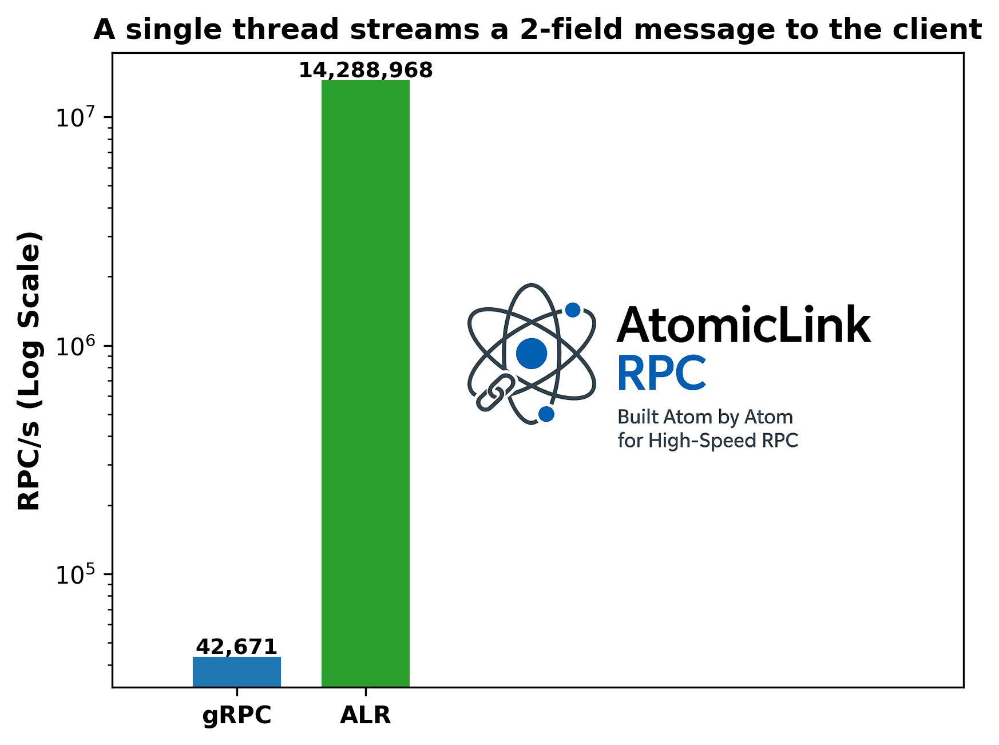

# AtomicLinkRPC (ALR) — Document Preview

Welcome! This repository contains the documentation preview for the AtomicLinkRPC (ALR) project. ALR is a high-performance C++ framework for building asynchronous, scalable, and easy-to-use RPC applications.

{ style="display:block; margin:auto; width:75%;" }

---

The documentation is structured to provide a comprehensive understanding of ALR, from a high-level overview to deep technical details.

-   **[Overview](./overview.md)**: A high-level introduction to ALR, its goals, and key features. Start here to get a feel for what ALR is all about.

-   **[User Guide](./user-guide.md)**: A practical guide with step-by-step instructions and examples to help you understand how to build your own ALR applications.

-   **[Examples](./examples.md)**: A collection of code examples demonstrating various features of ALR, from basic "Hello World" to advanced concepts like service discovery and peer-to-peer communication.

-   **[Technical Documentation](./technical.md)**: A deep dive into the architecture and design principles of ALR, including the compiler, schema negotiation, serialization, and threading model.

-   **[API Reference](./api-reference.md)**: A detailed reference for all public classes, methods, and types in the ALR framework.

-   **[Benchmarks](./benchmarks.md)**: A performance comparison between ALR and gRPC, showcasing ALR's significant speed advantages with detailed analysis and charts.

-   **[Promotional Brief](./promotional.md)**: A summary of ALR's value proposition, targeting executives and stakeholders who may not be familiar with the technical details.

-   **[Comprehensive Guide](./atomic-link-rpc.md)**: A single document that combines the most important information from all other documents into a comprehensive resource.

-   **[Raw Results (localhost)](./assets/results/raw_results_localhost.md)**: Raw performance results from a subset of tests used during ALR development, using loopback.
 
-   **[Raw Results (remote)](./assets/results/raw_results_remote.md)**: Raw performance results from a subset of tests used during ALR development, using a physical 2.5Gbps Ethernet connection between two physical hosts.

-   **Source Examples**: Source code from the CityGuide example:
    - [client_main.cpp](./assets/city_guide_example_src/client_main.cpp.md)
    - [city_guide_common.h](./assets/city_guide_example_src/city_guide_common.h.md)
    - [client.h](./assets/city_guide_example_src/client.h.md)
    - [client.cpp](./assets/city_guide_example_src/client.cpp.md)
    - [service.h](./assets/city_guide_example_src/service.h.md)
    - [service.cpp](./assets/city_guide_example_src/service.cpp.md)
    - [service_main.cpp](./assets/city_guide_example_src/service_main.cpp.md)
    - [alr.cfg](./assets/city_guide_example_src/alr.cfg.md)

---
Notes

- This is a docs-only preview; APIs and performance may change.
- If a link is broken, please file feedback using the template in the repository.
- For additional information, email <alr-project@alienworks.com>.
